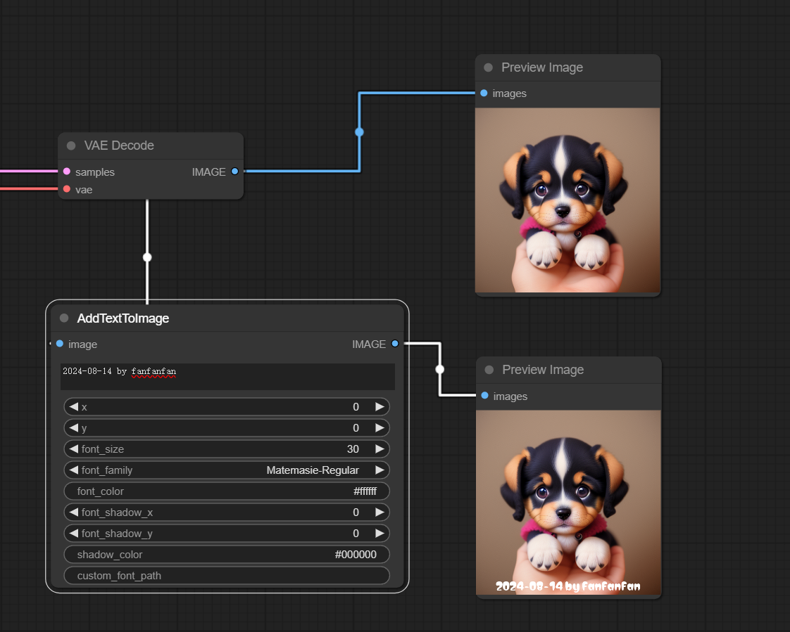
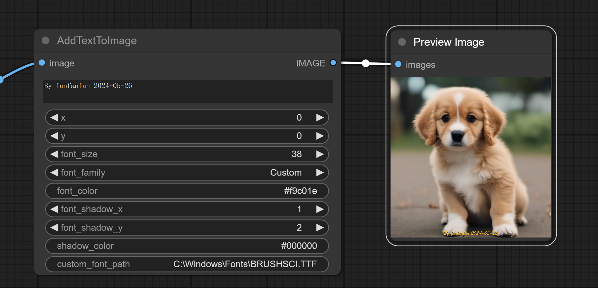

# 使用
- 节点位置：Add Node / AI_Boy / AddTextToImage

# 字体
其中，_fonts_ 文件夹（如果需要指定自定义字体，则将字体文件放在当前节点的 _fonts_ 目录下）中存放的是本地字体文件，即文案展示时的字体样式，该字体文件非必须，可以在节点的`custom_font_path`中直接指定字体的路径。支持的字体格式后缀为`.ttf/.TTF/.ttc/.TTC`

# 节点属性
| 属性               | 描述                                                   | 必须                                                                                                                                                       |
|------------------|------------------------------------------------------|----------------------------------------------------------------------------------------------------------------------------------------------------------|
| image            | 节点的输入类型必须为image                                      | 是                                                                                                                                                        |
| IMAGE            | 节点的输出类型为IMAGE                                        | 是                                                                                                                                                        |
| x                | 文案展示在图片x轴坐标的位置                                       | 否。默认位于图片正下方                                                                                                                                              |
| y                | 文案展示在图片y轴坐标的位置                                       | 否。默认位于图片正下方                                                                                                                                              |
| font_size        | 字体大小                                                 | 是                                                                                                                                                        |
| font_family      | 字体样式                                                 | 是。  如果 fonts 文件夹下有字体，则可以选择 fonts 文件夹（comfyui/custom_nodes/fonts）中的字体。当该属性的值为 "Custom" 时，需要指定 "custom_font_path" 属性的值                                                           |
| custom_font_path | 字体路径，如指定windows中自带的字体路径 "C:\Windows\Fonts\SIMLI.TTF" | 否。  当 "font_family"="Custom" 时，需要指定 "custom_font_path" 属性的值                                                                                          |
| font_color       | 字体颜色，支持RGB格式(255,255,255)、十六进制格式(#000000)            | 是。默认为 "#ffffff"，即白色                                                                                                                                      |
| font_shadow_x    | 字体阴影x轴偏移量                                            | 否。默认为0                                                                                                                                                   |
| font_shadow_y    | 字体阴影y轴偏移量                                            | 否。默认为0                                                                                                                                                   |
| shadow_color     | 字体阴影颜色                                               | 否。  当属性 "font_shadow_x"=0 并且属性 "font_shadow_y"=0 时，该属性不生效。   当属性 "font_shadow_x" 与 属性 "font_shadow_y" 有一个不为0时，该属性生效，且需要指定该属性的值。默认为 "#000000"，即黑色 |

# 安装
将该仓库克隆到 ComfyUI 的 custom_nodes 目录下，然后重启 ComfyUI。